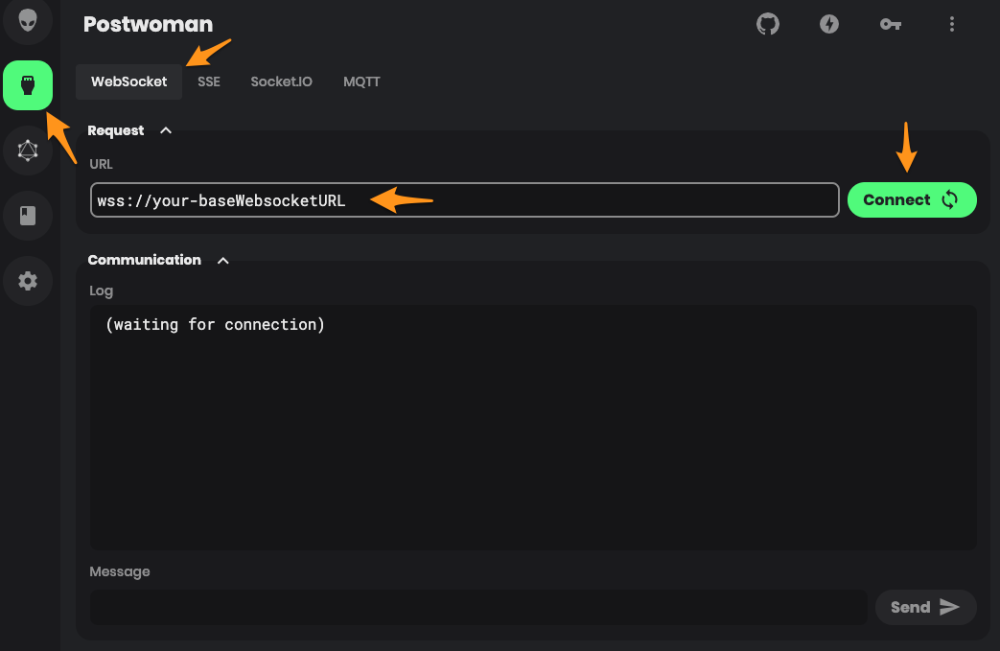

# Testing the Cart service
Here we will be learning how to interact with the Cart service we created in the [previous part of the example](part-1-build-and-deploy.md).
Although we will be using the commands, entities, events, and read models created there, you can follow these steps with
any other service you have created just by adapting the names and fields used in the requests.

After deploying your service successfully, Booster will have autogenerated a full-fledged GraphQL API based on your code. 
When the `boost deploy` command finishes, it will print useful information to interact with your system under the "Outputs" section.
You will see something like this:
````shell script
Outputs:
<application name>.httpURL = https://<API ID>.execute-api.<region>.amazonaws.com/<environment name>
<application-name>.websocketURL = wss://<API ID>.execute-api.<region>.amazonaws.com/<environment name>
# ... other outputs we are not interested in right now...
````
We will use the `httpURL` to send GraphQL _queries_ and _mutations_ (commands), while the `websocketURL` will be
needed for _subscriptions_ (as we need a two-way communication)

To do the following manual tests, we recommend you to use one of the several clients with full support for GraphQL, like [Postwoman](https://postwoman.io/)
However, you can use any HTTP client capable of sending POST requests with a JSON body (like [Postman](https://www.postman.com/)) for _queries_ and _mutations_, 
and any websocket client (like [wscat](https://github.com/websockets/wscat)) for _subscriptions_

## Sending commands
The way we send a command to our Booster app is by using a GraphQL "mutation". The following GraphQL request is sending the 
command `ChangeCart` with all its required payload:  

**URL:** `<httpURL>/graphql`
**GraphQL body:**
```graphql 
mutation {
  ChangeCart(input: {
      cartId: "demo"
      sku: "ABC_01"
      quantity: 2
  })
}
```
In case you are using an HTTP client without support for GraphQL, you can do exactly the same by sending an HTTP request with
method "POST" and include a JSON body with a field named "query" with the GraphQL mutation:
**URL:** `<httpURL>/graphql`
**Method:** `POST`
**Body:**
```json
{
   "query":"mutation { ChangeCart(input: { cartId: \"demo\" sku: \"ABC_01\" quantity: 2 }) }"
}
```

## Reading read models data
To read a read model, you send a GraphQL "query" operation. Let's get the read model the previous command modified:
**URL:** `<httpURL>/graphql`
**GraphQL body:**
```graphql 
query {
  CartReadModel(id: "demo") {
      id
      items
  }
}
```
This will return the read model data associated to ID "demo". You can also do searches to filter by any property your read model has. 
Check the [documentation](http://docs.booster.cloud/) to see all the available filters.

## Subscribing to read models 
Finally, you can also subscribe to your read models, allowing you to receive them in real time every time they are modified. 
To do that, you need to use a GraphQL "subscription" operation sent **through the websocket API**. We highly recommend using
subscriptions to get your read models data and, thus, build your client application with a reactive approach.

Before sending any subscription, you first need to connect to the websocket. 

If you are using "Postwoman" (the process is the pretty similar with the command line tool "wscat"), just go to the "Realtime"
section, write your `websocketURL`, and click connect:



Once you are connected you can send the following subscription by writing the following in the input text box:
```json
{"query": "subscription { CartReadModel(id:\"demo\") { id items } }" }
```
If you receive nothing as a response, then everything went good.

Now, to see this subscription in action, send some more commands like the one we sent before. After each command is processed,
you should receive the updated read model in your Postwoman client:


Now, you are ready to add some event handler to build more complex use cases. Go to _"[Part 3: Adding event handlers](part-3-add-event-handlers.md)"_


